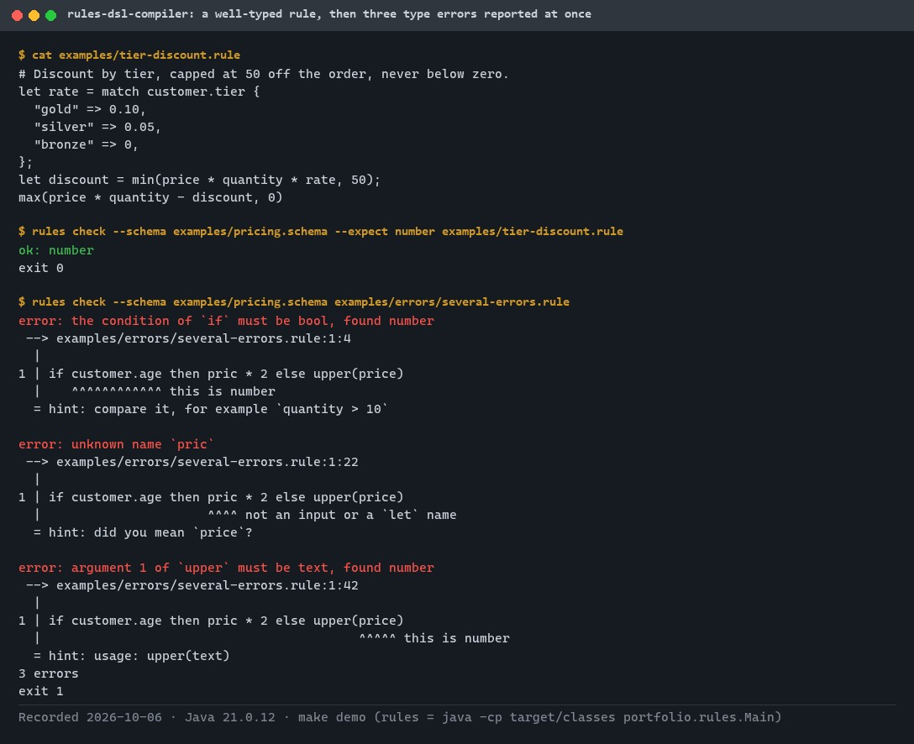
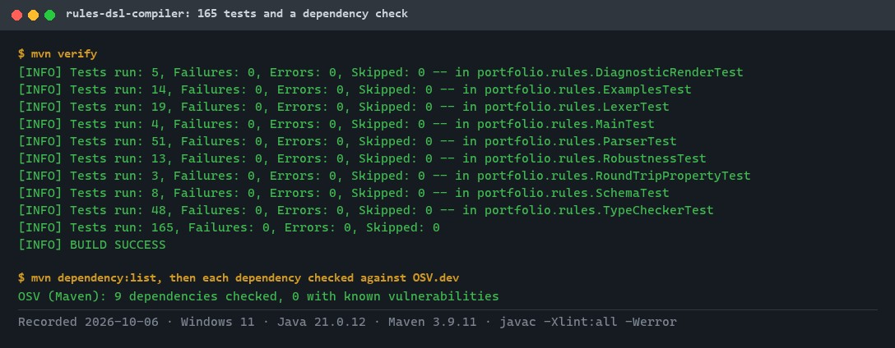
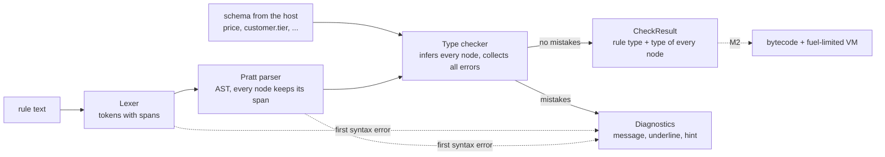
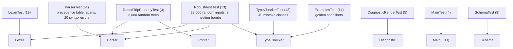

# rules-dsl-compiler

[](https://github.com/EquinoxWN/rules-dsl-compiler/actions/workflows/ci.yml)


> A small typed language for pricing and eligibility rules: a hand-written parser and type checker that report every mistake at once, with its exact position and a hint, before the rule ships.

Part of my **Distributed Systems & Storage** list · Java · core project

## Proof it works

The command-line checker accepts a well-typed pricing rule, then reports every type error in a broken one at once, each with the exact span, a label and a hint:



165 tests (lexer, Pratt parser, round-trip and span properties, type checker, diagnostics, examples) pass, and no dependency has a known vulnerability:



## Architecture

**What M1 runs today:**



**Full roadmap (M1 to M3):**


## How it works

_Steps 1 and 2 are built and tested (M1); the rest is on the [roadmap](#roadmap)._

1. Source such as `if customer.tier == "gold" then price * 0.9 else price` is tokenized, and a Pratt parser builds an AST that keeps source spans for every node.
2. A type checker infers types, rejects mistakes (text times number, missing match arms) and prints errors with the offending code underlined.
3. An optimizer folds constants and removes dead branches, then the compiler emits compact bytecode; a disassembler prints it for debugging.
4. A stack VM runs the bytecode with a fuel counter, so a rule can never loop forever, and only whitelisted builtins can be called.
5. An LSP server gives editors live errors and autocomplete, so non-engineers can write rules without breaking production.
6. Snapshot tests pin parser and compiler output, and a fuzzing campaign feeds random programs to prove the VM never panics.

## Tech stack

| Area | In M1 | Planned |
|---|---|---|
| Core | Java 21, hand-written lexer + Pratt parser, sealed-class AST with source spans, type checker | Optimizer and bytecode compiler |
| Runtime | - | Stack-based bytecode VM with fuel limits and whitelisted builtins |
| Tooling | JUnit | Snapshot tests, Jazzer fuzzing, LSP4J language server |

Language: **Java 21**, no runtime dependencies (JUnit for tests). Code in `src/main/java/portfolio/rules/`, example rules in [`examples/`](examples).

## Run it

**Prerequisites:** JDK 21+ and Maven 3.9+. Nothing else is needed; JUnit is the only dependency.

```bash
make setup   # resolve dependencies
make lint    # compile with -Xlint:all -Werror
make test    # 165 tests (about 10 seconds)
make demo    # check the example rules with the command-line tool
```

Without `make`: run `mvn verify`, then for example
`java -cp target/classes portfolio.rules.Main check --schema examples/pricing.schema --expect number examples/tier-discount.rule`.

### The language in one minute

A rule is one expression over inputs declared in a schema ([`examples/pricing.schema`](examples/pricing.schema)):

```text
price: number
quantity: number
customer: { tier: enum("gold", "silver", "bronze"), age: number, country: text, newsletter: bool }
```

| Rule | Type |
|---|---|
| `if customer.tier == "gold" then price * 0.9 else price` | number |
| `customer.age >= 18 and customer.country in ["NL", "BE", "LU"]` | bool |
| `let rate = match customer.tier { "gold" => 0.10, "silver" => 0.05, "bronze" => 0 }; max(price * quantity * (1 - rate), 0)` | number |

Operators from loosest to tightest: `or`, `and`, `not`, comparisons and `in` (cannot be chained), `+ -`, `* / %`,
unary `-`, then `.field` and calls. Builtins: `abs ceil floor round min max len lower upper trim startsWith endsWith contains`.
Numbers are exact decimals, never floating point.

When a rule is wrong, every independent mistake is reported at once:

```text
$ rules check --schema examples/pricing.schema examples/errors/several-errors.rule
error: the condition of `if` must be bool, found number
 --> examples/errors/several-errors.rule:1:4
  |
1 | if customer.age then pric * 2 else upper(price)
  |    ^^^^^^^^^^^^ this is number
  = hint: compare it, for example `quantity > 10`

error: unknown name `pric`
 --> examples/errors/several-errors.rule:1:22
  |
1 | if customer.age then pric * 2 else upper(price)
  |                      ^^^^ not an input or a `let` name
  = hint: did you mean `price`?

error: argument 1 of `upper` must be text, found number
 --> examples/errors/several-errors.rule:1:42
  |
1 | if customer.age then pric * 2 else upper(price)
  |                                          ^^^^^ this is number
  = hint: usage: upper(text)
3 errors
```

More broken rules and their exact output: [`examples/errors/`](examples/errors).

### Use it from Java

```java
Schema schema = Schema.parse(Files.readString(Path.of("examples/pricing.schema")));
CheckResult result = Rules.check(ruleText, schema, Type.NUMBER); // never throws for any rule text
if (!result.ok()) {
    System.out.print(Rules.render(Source.of(ruleText), result.diagnostics()));
}
```

## Tests and results

Full numbers and commands: [docs/results/m1.md](docs/results/m1.md).

| Check | Result |
|---|---|
| Tests (`make test`) | **165 passed**, 0 failed |
| Lint (`-Xlint:all -Werror`) | no warnings |
| Precedence and associativity | 24 cases pinned, mirroring the binding-power table |
| Round-trip property | print then parse is the identity on 3,000 random trees |
| Span property | every node's span, parsed alone, gives that node (3,000 random trees + examples) |
| Type errors | 40 mistake classes, each with one exact message; no cascades |
| Robustness | 28,000 random inputs and 9 nesting bombs (20,000 levels): diagnostics, never an exception |
| Mutation check | 6 deliberate bugs, each caught by 2 to 10 tests |

| Test class | What it proves |
|---|---|
| `LexerTest` | Exact token spans, decimals, escapes, and clear errors for bad characters, numbers and text |
| `ParserTest` | Operator precedence and associativity, the README example's tree, spans, syntax errors with hints, nesting limit |
| `RoundTripPropertyTest` | Parser and printer agree on every random tree; spans point at exactly the right code |
| `TypeCheckerTest` | Inference, enum value checks, exhaustive `match`, `if` without `else`, builtins, suggestions, error collection |
| `DiagnosticRenderTest` | Line, column (emoji count as one), underline width and hints in the rendered output |
| `ExamplesTest` | Example rules check; broken examples print exactly their stored snapshot |
| `MainTest` | CLI output and exit codes |
| `SchemaTest` | Schema parsing and its error messages |
| `RobustnessTest` | No input crashes the front end |

### Test map



## Roadmap

**M1** (≈15 h)
- [x] Write `docs/rfc/0001-design.md`: problem, goals, non-goals, chosen design
- [x] Source such as `if customer.tier == "gold" then price * 0.9 else price` is tokenized, and a Pratt parser builds an AST that keeps source spans for every node.
- [x] A type checker infers types, rejects mistakes (text times number, missing match arms) and prints errors with the offending code underlined.

**M2** (≈20 h)
- [ ] An optimizer folds constants and removes dead branches, then the compiler emits compact bytecode; a disassembler prints it for debugging.
- [ ] A stack VM runs the bytecode with a fuel counter, so a rule can never loop forever, and only whitelisted builtins can be called.

**M3** (≈25 h)
- [ ] An LSP server gives editors live errors and autocomplete, so non-engineers can write rules without breaking production.
- [ ] Snapshot tests pin parser and compiler output, and a fuzzing campaign feeds random programs to prove the VM never panics.
- [ ] Publish the proof below with real numbers

## Proof

What this repo must show before it counts as done:

- Tree-walking interpreter vs bytecode VM benchmark, fuzzing hours with zero crashes, and a GIF of the LSP catching errors live.

| Result | Value |
|---|---|
| M3 proof above | Not measured yet (M3). Current M1 numbers: see [Tests and results](#tests-and-results). |

## Why it matters

- **Interview angle:** 'Design a rules engine' and 'how does a compiler work?'
- **Upstream I'd like to contribute to:** Google's cel-java or ANTLR: grammar tests and fixes.

## Design docs

- [RFC 0001: design](docs/rfc/0001-design.md)
- [ADR 0001: record architecture decisions](docs/adr/0001-record-architecture-decisions.md)
- [ADR 0002: hand-written Pratt parser](docs/adr/0002-hand-written-pratt-parser.md)
- [ADR 0003: report every independent type error](docs/adr/0003-collect-all-type-errors.md)
- [M1 results](docs/results/m1.md)

## Scope

This is a learning and portfolio system, not a hosted production service. Everything runs locally.

## Security and contributing

- Every GitHub Action is pinned to a commit SHA; workflows run read-only, without persisted credentials.
- Dependabot proposes dependency and action updates weekly.
- CI compiles with every warning as an error and runs 28,000 random inputs that must never crash the checker; JUnit (test scope) is the only dependency.
- Report vulnerabilities privately: see [SECURITY.md](SECURITY.md). To contribute, see [CONTRIBUTING.md](CONTRIBUTING.md).

## License

MIT, see [LICENSE](LICENSE).
