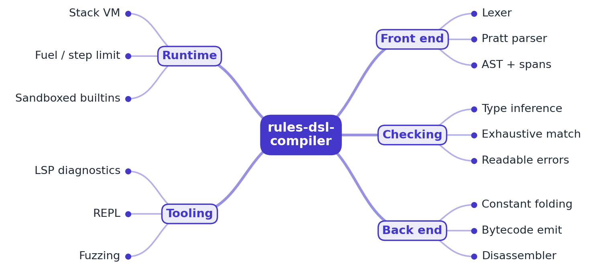

# RFC 0001: rules-dsl-compiler design

- **Status:** Accepted (M1 implemented)
- **Author:** EquinoxWN
- **Created:** 2026

## Problem

Pricing, discount and eligibility logic changes far more often than the code around it. When
every change needs an engineer and a deploy, the business waits days for a one-line edit; when
the logic is pushed into a spreadsheet or a free-form script, one typo (`price * "0.9"`, a missing
customer tier, a loop that never ends) breaks checkout in production. The goal is a small rules
language, in the spirit of Google's CEL, that non-engineers can edit safely: every rule is
checked against the data it may read before it is saved, mistakes are explained in plain words
with the offending code underlined, and (from M2) a rule can never crash or run forever.

## Goals

- Rules are single expressions over a typed input schema supplied by the host application, for
  example `if customer.tier == "gold" then price * 0.9 else price`.
- A hand-written lexer and Pratt parser build an AST in which every node keeps the source span it
  came from, so every later error can point at exact code.
- A type checker infers the type of every node, rejects mistakes (text times number, unknown
  fields, a tier that does not exist, a `match` that forgets a case, an `if` without `else`) and
  reports all independent mistakes at once, each with an underlined snippet and a hint.
- No input can crash the front end: size and nesting limits turn hostile input into a diagnostic
  instead of an exception or stack overflow.
- Later: constant folding and bytecode (M2), a stack VM with a fuel limit and whitelisted builtins
  (M2), an LSP server and a fuzzing campaign (M3).

## Non-goals

- A general-purpose language: no user-defined functions, loops, recursion or mutation. Rules are
  total expressions, which is what makes "can never loop forever" provable.
- Running as a hosted production service; this is a library plus a command-line tool.
- Floating point: money needs exact decimals, so numbers are `BigDecimal`.

## Proposed design



```
rule text ─► Lexer ─► tokens ─► Pratt parser ─► AST (+ spans) ─► TypeChecker(schema) ─► CheckResult
                │                    │                                │                  (type, diagnostics,
                └── first syntax error as a Diagnostic ───────────────┴── all type errors   type of every node)
```

| Part | M1 implementation |
|---|---|
| Lexer | Hand-written, one pass; exact-decimal numbers, escapes including `\u{1F600}`, `#` comments; 64 KiB source limit |
| Parser | Pratt parser: one binding-power table for 14 infix operators, prefix `-`/`not`, postfix `.field` and calls; comparisons are non-associative (`a < b < c` is an error with a hint); 200-level nesting limit counted both on recursion and on tree height |
| AST | Java 21 sealed interface with 13 record node types; `Paren` nodes are kept so spans include parentheses |
| Schema | Host-supplied input types: `number`, `text`, `bool`, `enum("gold", ...)`, `list(T)`, nested records; parsed from a small text format or built in code |
| Types | `number`, `text`, `bool`, enums (a kind of text whose literals are checked), lists, records; an `ERROR` type silences follow-on errors and `NEVER` types the empty list |
| Checker | Bottom-up inference with `let` scopes; exhaustiveness for `match` on bool and enums, unreachable and duplicate arms, division by a literal zero, 13 whitelisted builtins with arity and argument checks |
| Diagnostics | Message, span, label and hint, rendered compiler-style with line, column (in code points) and an underline |
| CLI | `rules check --schema <file> [--expect type] <rule>` and `rules ast <rule>` (prints the fully parenthesised parse) |

The rule grammar, lowest to highest precedence:

```
expr    := 'if' expr 'then' expr ['else' expr] | 'let' NAME '=' expr ';' expr | 'match' expr '{' arms '}' | binary
binary  := or-chain of: 'or' < 'and' < 'not' (prefix) < == != < <= > >= in (non-associative) < + - < * / % < '-' (prefix) < .field / call
primary := NUMBER | TEXT | 'true' | 'false' | NAME | '(' expr ')' | '[' items ']'
arms    := pattern '=>' expr (',' pattern '=>' expr)* [',']      pattern := NUMBER | '-' NUMBER | TEXT | 'true' | 'false' | '_'
```

## Alternatives considered

| Option | Why not (yet) |
|---|---|
| ANTLR-generated parser | Fast to start and the upstream target of this project, but error messages and recovery are generic ("mismatched input"), spans need a mapping layer, and it adds a runtime dependency. A hand-written Pratt parser keeps full control of messages, which is the main product here. See ADR 0002. |
| Embed CEL (cel-java) directly | Production-grade and well specified, but the point of the repo is to build and explain the compiler, and CEL's error output is aimed at engineers, not at people editing pricing rules. |
| Embed a scripting engine (JavaScript, Groovy, Lua) | Turing-complete: loops, recursion and arbitrary host calls make "cannot crash, cannot run forever" impossible to guarantee, and sandboxing them is a security project of its own. |
| Recursive descent with one function per precedence level | Equivalent power, but ten near-identical functions; the Pratt table puts precedence and associativity in one place, which also makes the precedence tests a direct mirror of the table. |
| Stop at the first type error | Simpler, but users then fix one mistake per save. Reporting every independent error with an `ERROR` type to stop cascades is what mature compilers do. See ADR 0003. |
| Dynamic typing with runtime errors | No checker needed, but every mistake becomes a production incident. The whole point is to catch them when the rule is saved. |

## Measurement plan

- M1: 165 tests. Precedence and associativity tables, spans, round-trip and span properties over
  3,000 random trees each, every type-error class with its exact message, rendered snapshots for
  the example rules, and 28,000 random inputs that must end in diagnostics, never exceptions. A
  mutation check proves the guards are tested (each of six deliberate bugs fails 2 to 10 tests).
- M2: tree-walking interpreter vs bytecode VM throughput on a corpus of real-shaped rules.
- M3: fuzzing hours with zero crashes (Jazzer), and LSP latency for live diagnostics.

## Milestones

- **M1 (done):** lexer, Pratt parser with spans, schema, type checker with collected diagnostics,
  CLI, 165 tests.
- **M2:** constant folding and dead-branch removal, bytecode compiler and disassembler, stack VM
  with fuel counter and whitelisted builtins, interpreter-vs-VM benchmark.
- **M3:** LSP server (diagnostics, completion from the schema), snapshot tests for compiler
  output, Jazzer fuzzing campaign, proof table.

## Risks and open questions

- Enums are compared with text literals (`customer.tier == "gold"`), which is friendly but means a
  non-literal text compared with an enum is only checked at run time (M2 must handle a value that
  is not a variant).
- `round(x, digits)` and division are typed but not yet evaluated; M2 must define rounding mode
  (banker's vs half-up) and division scale explicitly for money.
- The 200-level nesting limit is generous for hand-written rules; generated rules may need a
  configurable limit.
